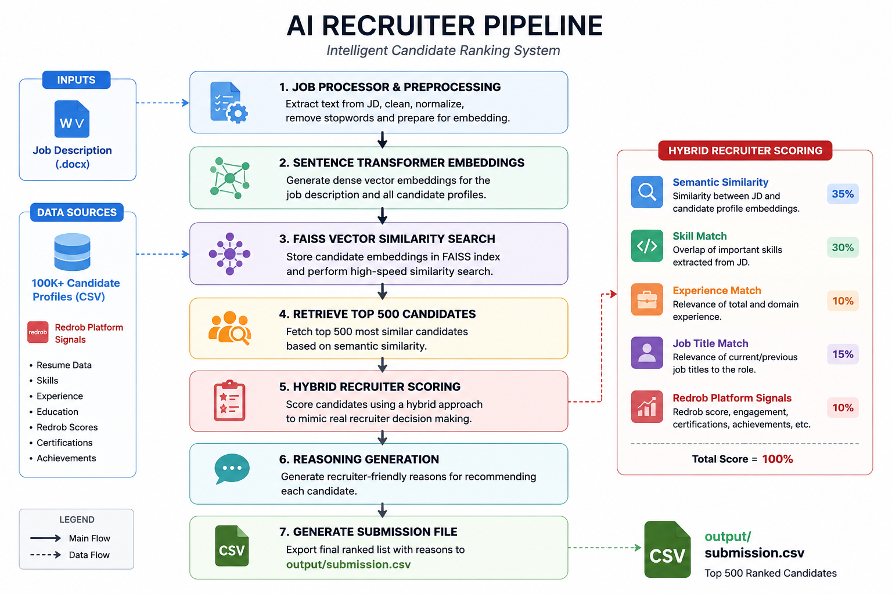

# AI Recruiter – Intelligent Candidate Ranking System

## Overview

AI Recruiter is an AI-powered recruitment assistant built for the India Runs Data & AI Challenge.

Instead of relying on keyword matching, the system understands job descriptions and candidate profiles semantically to recommend the most suitable candidates.

The pipeline combines semantic search, vector embeddings, FAISS indexing, and hybrid recruiter scoring to rank candidates more like an experienced recruiter.

---

## Features

- Semantic understanding of Job Descriptions
- Candidate profile preprocessing
- Sentence Transformer embeddings
- FAISS vector search
- Hybrid recruiter scoring
- Recruiter-friendly reasoning generation
- Automatic submission generation

---

## Architecture



---

## Tech Stack

- Python
- Sentence Transformers
- FAISS
- NumPy
- Pandas
- Scikit-learn

---

## Project Structure

```
AI-Recruiter-Hackathon/
│
├── data/
├── docs/
├── models/
├── output/
├── src/
├── tests/
├── assets/
├── README.md
├── requirements.txt
└── .gitignore
```

---

## Installation

```bash
git clone <repository_url>

cd AI-Recruiter-Hackathon

python -m venv venv

venv\Scripts\activate

pip install -r requirements.txt
```

---

## Run

```bash
python src/main.py
```

---

## Output

The ranked candidates are generated as

```
output/submission.csv
```

The file follows the official submission specification.

---

## Methodology

1. Load Job Description

2. Preprocess Candidate Profiles

3. Generate Embeddings

4. Semantic Search using FAISS

5. Hybrid Recruiter Scoring

6. Generate Reasoning

7. Export Submission

---

## Future Improvements

- Cross Encoder Re-ranking
- LLM-based recruiter reasoning
- Skill ontology matching
- Multi-job recommendation engine
- Learning-to-Rank models

---

## License

MIT License

## Results

- Successfully processed **100,000 candidate profiles**
- Generated semantic embeddings using **Sentence Transformers**
- Built a **FAISS vector index** for efficient retrieval
- Retrieved the **Top 500 candidates**
- Produced a **submission.csv** that passes the official validator
- Generated recruiter-friendly reasoning for each recommendation